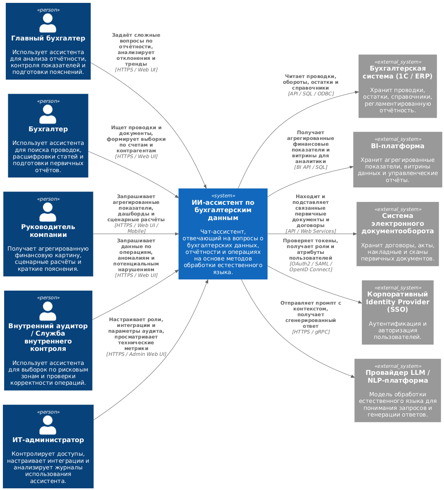
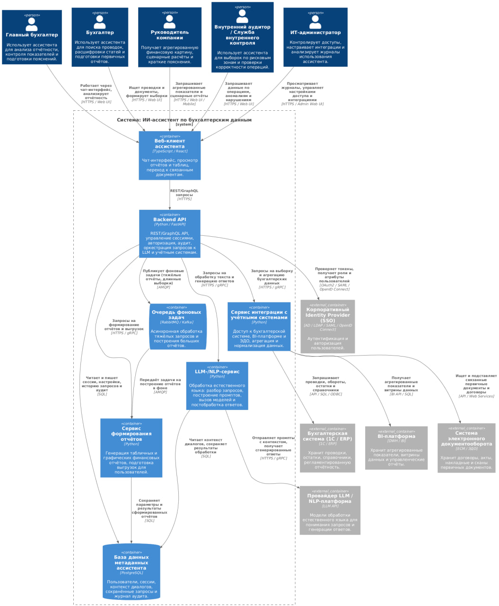
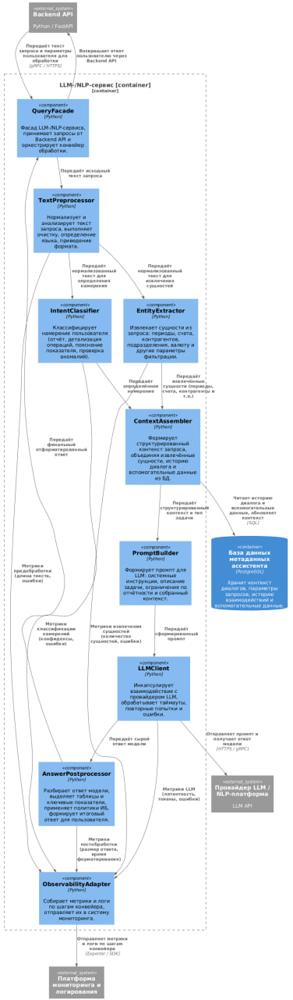

# Диаграмма системного контекста

## Основные элементы диаграммы

**Центральная система**

- **ИИ-ассистент по бухгалтерским данным**  
  Чат-ассистент, отвечающий на вопросы о бухгалтерских данных, отчётности и
  хозяйственных операциях на основе методов обработки естественного языка.
  Получает запросы от пользователей через веб-интерфейс, обращается к
  учётным системам и сервису LLM, формирует структурированные ответы.

**Внутренние пользователи**

- **Главный бухгалтер**  
  Использует ассистента для анализа регламентированной и управленческой
  отчётности, контроля ключевых показателей, подготовки пояснительных записок.
  Посылает сложные аналитические запросы, отслеживает отклонения и тренды.

- **Бухгалтер**  
  Работает с проводками и первичными документами, использует ассистента для
  поиска операций по счёту, контрагенту или периоду, для расшифровки статей
  и формирования выборок для отчётов.

- **Руководитель компании**  
  Запрашивает агрегированную финансовую картину, дашборды по выручке, затратам,
  маржинальности, а также сценарные расчёты и короткие текстовые выводы,
  пригодные для управленческих решений.

- **Внутренний аудитор / Служба внутреннего контроля**  
  Применяет ассистента для поиска операций в рисковых зонах, проверки соблюдения
  регламентов, выявления аномалий в движении средств и формирования выборок
  для аудиторских процедур.

- **ИТ-администратор**  
  Отвечает за эксплуатацию решения: настраивает интеграции и роли доступа,
  контролирует использование ассистента, анализирует журналы действий
  пользователей и технические метрики.

**Внешние системы**

- **Бухгалтерская система (1С / ERP)**  
  Основной источник данных: проводки, обороты, остатки, справочники
  (счета, контрагенты, статьи затрат), регламентированная отчётность.
  Ассистент читает из неё детализированные записи для построения выборок
  и пояснений.

- **BI-платформа**  
  Хранилище агрегированных показателей и витрин: обороты по направлениям,
  отчёты по подразделениям, сводные показатели. Ассистент использует
  эти витрины для быстрых управленческих запросов и визуализации.

- **Система электронного документооборота**  
  Хранит договоры, акты, накладные и сканы первичных документов.
  Ассистент по ссылке из проводки может находить и подставлять связанные
  документы для пользователя.

- **Корпоративный Identity Provider (SSO)**  
  Отвечает за аутентификацию и авторизацию пользователей на основе AD/LDAP,
  SAML или OpenID Connect. Ассистент проверяет токены, получает роли и
  атрибуты пользователя, чтобы ограничивать доступ к данным.

- **Провайдер LLM / NLP-платформа**  
  Предоставляет модель обработки естественного языка, которая выполняет
  понимание запросов и генерацию текстовых ответов. Ассистент формирует
  промпты с контекстом и передаёт их провайдеру, а затем использует
  полученный ответ при формировании результата для пользователя.

---

# Диаграмма контейнеров

## Основные контейнеры

- **Веб-клиент ассистента (TypeScript / React)**  
  Одностраничное веб-приложение, предоставляющее чат-интерфейс, таблицы и
  графики. Через него пользователи формулируют запросы, просматривают
  результаты, переходят к связанным первичным документам. Веб-клиент
  взаимодействует с Backend API по HTTPS (REST/GraphQL).

- **Backend API (Python / FastAPI)**  
  Серверное приложение – единая точка входа для всех клиентских запросов.
  Отвечает за:
  - приём и валидацию запросов от веб-клиента;
  - аутентификацию и авторизацию через SSO;
  - управление диалоговыми сессиями и контекстом;
  - аудит действий пользователей;
  - оркестрацию вызовов LLM-/NLP-сервиса, сервиса интеграции и сервиса отчётов;
  - постановку тяжёлых задач в очередь фоновых заданий.

- **LLM-/NLP-сервис (Python)**  
  Специализированный сервис обработки естественного языка. Получает текстовые
  запросы и данные контекста от Backend API, проводит конвейер обработки и возвращает
  структурированный результат.

- **Сервис интеграции с учётными системами (Python)**  
  Инкапсулирует взаимодействие с бухгалтерской системой,
  BI-платформой и системой электронного документооборота. Отвечает за вызовы
  внешних API/SQL, трансформацию данных в единый формат, агрегацию и
  объединение информации для отчётов и пояснений.

- **Сервис формирования отчётов (Python)**  
  Формирует табличные и графические отчёты на основе данных, полученных
  через сервис интеграции и BI-платформу. Поддерживает генерацию отчётов
  по запросу пользователя и фоновую подготовку тяжёлых отчётов с последующей
  выдачей готового результата.

- **База данных метаданных ассистента (PostgreSQL)**  
  Хранит пользователей и их роли, настройки, диалоговые сессии, историю
  запросов, параметры и результаты сформированных отчётов, а также журналы
  аудита. Используется Backend API, LLM-/NLP-сервисом и сервисом формирования
  отчётов.

- **Очередь фоновых задач (RabbitMQ / Kafka)**  
  Обеспечивает асинхронную обработку ресурсоёмких операций – построение
  больших отчётов, сложные выборки, периодические расчёты. Backend API
  ставит задачи в очередь, а сервис формирования отчётов забирает их
  на обработку.

## Взаимодействие с внешними системами

- **Backend API - Корпоративный Identity Provider (SSO)**  
  Проверяет токены, получает набор ролей и атрибутов пользователя, чтобы
  реализовать ролевую модель доступа в ассистенте.

- **Сервис интеграции - Бухгалтерская система (1С / ERP)**  
  Выполняет выборку проводок, оборотов, остатков и справочников по API / SQL /
  ODBC-подключениям. Эти данные затем используются в отчётах и ответах
  ассистента.

- **Сервис интеграции - BI-платформа**  
  Получает агрегированные показатели и витрины для аналитики управленческих
  запросов.

- **Сервис интеграции - Система электронного документооборота**  
  Ищет и возвращает связанные первичные документы по реквизитам из проводок, позволяя пользователю быстро
  перейти к нужному документу.

- **LLM-/NLP-сервис - Провайдер LLM / NLP-платформа**  
  Отправляет сформированный промпт с контекстом, получает от модели ответ,
  учитывает таймауты и ошибки, следит за объёмом токенов.

## Причины выбора архитектурного стиля

В основе решения лежит многослойная клиент–серверная архитектура с
элементами микросервисности:

- интерфейс отделён от серверной логики, что позволяет
  независимо развивать UI и backend и масштабировать их по разным
  метрикам нагрузки;
- LLM-/NLP-сервис и сервис интеграции выделены в отдельные контейнеры –
  они наиболее ресурсоёмкие и зависят от внешних поставщиков, поэтому их удобно масштабировать и обновлять независимо;
- сервис формирования отчётов и очередь фоновых задач обеспечивают работу
  с тяжёлыми запросами без деградации отклика в диалоговом интерфейсе;
- единая БД метаданных и централизованный Backend API упрощают реализацию
  безопасности, аудита и ролевой модели доступа.

Такой подход даёт гибкость при развитии системы, повышает отказоустойчивость
и позволяет подстраивать масштабирование под реальные нагрузки на LLM,
отчёты и интеграции.

---

# Диаграмма компонентов

## Основные компоненты LLM-/NLP-сервиса

- **QueryFacade (Python)**  
  Фасад сервиса: принимает запросы от Backend API, запускает последовательные шаги конвейера,
  обрабатывает ошибки верхнего уровня и возвращает готовый ответ.

- **TextPreprocessor (Python)**  
  Выполняет предобработку текста: удаляет лишние символы, нормализует
  формат, может приводить к единому регистру, определять язык, разбивать
  запрос на логические части. Обеспечивает стабильную работу последующих
  шагов.

- **IntentClassifier (Python)**  
  По нормализованному тексту определяет намерение пользователя: построение
  отчёта, детализация операций, пояснение показателя, поиск аномалий и т.п.
  Результат влияет на выбор дальнейших шагов и шаблонов промпта.

- **EntityExtractor (Python)**  
  Извлекает доменные сущности: период, счета, контрагентов,
  подразделения, валюты, пороговые значения, идентификаторы документов.
  Эти сущности затем используются как параметры фильтрации и контекста.

- **ContextAssembler (Python)**  
  Собирает структурированный контекст запроса, объединяя намерение,
  извлечённые сущности, историю диалога и вспомогательные данные из
  базы метаданных ассистента. Ограничивает размер контекста, приоритизируя
  наиболее важную для ответа информацию.

- **PromptBuilder (Python)**  
  Формирует промпт для LLM: добавляет системные инструкции, описание задачи, ограничения по
  бухгалтерскому учёту и собранный контекст. Обеспечивает воспроизводимое
  поведение модели.

- **LLMClient (Python)**  
  Инкапсулирует взаимодействие с провайдером LLM / NLP-платформой.
  Отправляет промпт, отслеживает таймауты, выполняет повторные попытки при
  временных ошибках, собирает метрики по латентности и объёму токенов.

- **AnswerPostprocessor (Python)**  
  Разбирает сырой ответ модели: выделяет таблицы и числовые показатели,
  проверяет корректность формата, применяет политики информационной
  безопасности. Формирует структурированный ответ для Backend API.

- **ObservabilityAdapter (Python)**  
  Сборщик наблюдаемости: агрегирует метрики и логи по каждому шагу
  конвейера и отправляет их в платформу мониторинга и логирования.

## Взаимодействие с внешними элементами

- **Backend API**  
  Передаёт входной текст запроса и параметры пользователя в компонент
  QueryFacade и получает от него финальный ответ, который затем отдаётся
  веб-клиенту.

- **База данных метаданных ассистента (PostgreSQL)**  
  Используется компонентом ContextAssembler для чтения истории диалога и
  вспомогательных данных и для сохранения контекста текущего запроса.

- **Провайдер LLM / NLP-платформа**  
  Получает от компонента LLMClient сформированный промпт с контекстом,
  возвращает сгенерированный текст; именно здесь выполняется основная
  работа большой языковой модели.

- **Платформа мониторинга и логирования**  
  Принимает метрики и логи от ObservabilityAdapter: время обработки,
  статус запросов, статистику по токенам, ошибки. Эти данные используются
  для анализа производительности и отладки конвейера.

Системный контекст показывает место ассистента в ландшафте предприятия, диаграмма контейнеров описывает
внутреннюю архитектуру решения, а диаграмма компонентов LLM-/NLP-сервиса детализирует ключевой интеллектуальный блок системы.
